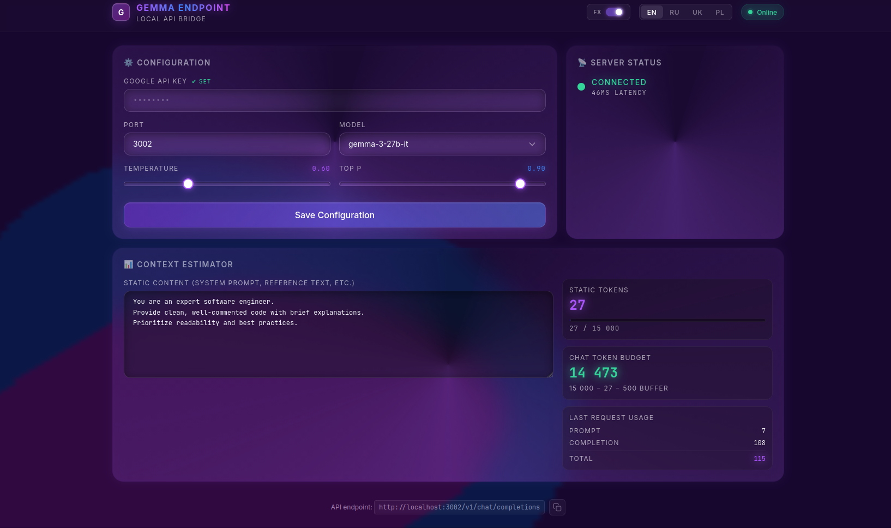

<!-- Language Links -->
<div align="center">
  <a href="#gemma-endpoint-english">🇺🇸 English</a> | 
  <a href="#gemma-endpoint-русский">🇷🇺 Русский</a> | 
  <a href="#gemma-endpoint-українська">🇺🇦 Українська</a> | 
  <a href="#gemma-endpoint-polski">🇵🇱 Polski</a>
</div>

<h1 align="center" id="gemma-endpoint-english">Gemma Endpoint</h1>
<p align="center">
  <em>A seamless local proxy to use Gemma 3 models for free in any AI client.</em>
</p>

<p align="center">
  
  
  
  
</p>



## What it does

Gemma Endpoint is a local proxy server that seamlessly translates OpenAI-format API requests to the Google AI Studio API. This allows developers and researchers to integrate Google's powerful Gemma 3 models into any OpenAI-compatible client, backend, or terminal tool for free, avoiding expensive API costs while maintaining existing workflows.

## Features

- **Local Dashboard UI:** A sleek, user-friendly interface to manage your endpoint settings locally.
- **Context Estimator & Token Counter:** Precisely monitor and estimate your token usage before sending requests.
- **Real-time Usage Telemetry:** Track your API usage patterns and connection metrics live.
- **Language Switcher:** Native dashboard interface support for English, Russian, Ukrainian, and Polish.
- **Auto Port Selection:** Eliminates connection conflicts by automatically finding and applying available ports.
- **Streaming Support:** Full support for real-time text generation matching the OpenAI streaming format.

### ⚠️ Important Notice on Content Policies & API Limits

- **Safety Settings:** By default, this endpoint bridge sets all Google safety filters to `BLOCK_NONE` to ensure uninterrupted text generation and prevent false-positive blockages during complex data analysis or creative writing.
- **Your Responsibility:** You are using your own personal Google API key to route requests. Please be aware that generating content that strictly violates Google's Terms of Service (ToS) may result in your API key being revoked or your Google Cloud account being temporarily suspended.
- _The creator of this bridge is not responsible for any account bans or quota restrictions imposed by Google. Please use the API responsibly and monitor your usage in the Google Cloud Console._

## Structure

```text
gemma-endpoint/
├── client/          # React/Vite frontend for the local dashboard UI
│   ├── src/         # React components, styles, and translation config
│   └── package.json # Frontend dependencies
├── src/             # Express.js backend for the proxy server
│   ├── routes/
│   │   ├── api.ts
│   │   └── completions.ts
│   ├── app.ts
│   ├── config.ts
│   ├── context.ts
│   ├── server.ts
│   ├── stream.ts
│   ├── translator.ts
│   └── types.ts
├── docs/            # the documentation and assets
├── config.json      # Persistent local configuration (API keys, ports)
├── package.json     # Project dependencies and scripts
└── start.sh / .bat  # Quick start scripts for Linux/Mac and Windows
```

## Requirements

- Node.js 18 or higher (or Termux for Android)
- Google AI Studio API Key (Get it for free at [aistudio.google.com](https://aistudio.google.com))

## Installation & Launch

### Windows / Linux / macOS

```bash
git clone https://github.com/itsfantomas/gemma-endpoint.git
cd gemma-endpoint
npm install
npm start
```

After starting, open your browser and navigate to the provided local URL (typically `http://localhost:3000`).

### Android (Termux)

```bash
pkg update && pkg upgrade
pkg install git nodejs
git clone https://github.com/itsfantomas/gemma-endpoint.git
cd gemma-endpoint
npm install
npm start
```

## Dashboard Usage

1. **API Key Setup:** Enter your Google AI Studio API key securely in the dashboard settings.
2. **Port Configuration:** Specify your desired port or let the auto-selector choose an open one.
3. **Context Estimator:** Paste your prompt into the estimator to gauge token consumption and ensure it fits within the context limits.

## Connecting a Client

To connect your terminal applications, chatbot backends, or any other OpenAI-compatible integrations:

- **Custom API Endpoint / Base URL:** `http://localhost:<PORT>/v1` (replace `<PORT>` with your proxy's running port)
- **API Key:** Use your Google AI Studio API key
- **Context Limit (Tokens):** Set your client's maximum context limit to `15000`

## License & Disclaimer

This tool is provided for free and is open source, but **strictly for non-commercial use**. You are free to install, modify, and use it for personal or educational purposes.
The author assumes no responsibility for how API keys are utilized. Users are solely responsible for their actions and for ensuring compliance with the Terms of Service of any third-party services they interact with.

**Author:** [itsfantomas](https://github.com/itsfantomas)

---

# Gemma Endpoint

> Бесшовный локальный прокси для бесплатного использования моделей Gemma 3 в любых ИИ-клиентах.


## Что это такое

Gemma Endpoint — это локальный прокси-сервер, который транслирует API-запросы формата OpenAI напрямую в Google AI Studio API. Это дает аналитикам и разработчикам возможность бесплатно интегрировать мощные модели Gemma 3 в любой терминал, бэкенд чат-ботов или OpenAI-совместимый интерфейс, оптимизируя затраты.

## Возможности

- **Локальный UI-дашборд:** Красивый и понятный интерфейс для управления настройками вашего эндоинта.
- **Оценка контекста и счетчик токенов:** Точный мониторинг объема текста до отправки запроса.
- **Телеметрия в реальном времени:** Отслеживайте статистику использования и метрики в режиме онлайн.
- **Выбор языка:** Полная поддержка английского, русского, украинского и польского интерфейсов.
- **Автоматический выбор порта:** Умный подбор свободного порта во избежание конфликтов.
- **Поддержка стриминга (Streaming):** Генерация текста в реальном времени (в потоковом формате OpenAI).

### ⚠️ Важное примечание о правилах использования и лимитах API

- **Настройки безопасности:** По умолчанию этот прокси-сервер устанавливает все фильтры безопасности Google в режим `BLOCK_NONE`, чтобы обеспечить бесперебойную генерацию текста и предотвратить ложные блокировки при парсинге сырых данных и анализе.
- **Ваша ответственность:** Вы используете свой личный API-ключ Google для перенаправления запросов. Имейте в виду, что создание контента, который строго нарушает Условия использования (ToS) Google, может привести к аннулированию вашего API-ключа или временной блокировке вашего аккаунта Google Cloud.
- _Создатель этого инструмента не несет ответственности за любые баны аккаунтов или ограничения квот, наложенные Google. Пожалуйста, используйте API ответственно и отслеживайте свое использование в Google Cloud Console._

## Структура проекта

```text
gemma-endpoint/
├── client/          # React/Vite фронтенд дашборда
│   ├── src/         # React-компоненты, стили и конфигурация перевода
│   └── package.json # Зависимости фронтенда
├── src/             # Express.js бэкенд прокси-сервера
│   ├── routes/
│   │   ├── api.ts
│   │   └── completions.ts
│   ├── app.ts
│   ├── config.ts
│   ├── context.ts
│   ├── server.ts
│   ├── stream.ts
│   ├── translator.ts
│   └── types.ts
├── docs/            # Документация и медиа-файлы
├── config.json      # Локальный файл конфигурации (ключи, порты)
├── package.json     # Общие зависимости и скрипты проекта
└── start.sh / .bat  # Скрипты быстрого запуска
```

## Требования

- Node.js 18+ (или Termux для Android)
- API-ключ Google AI Studio (получите бесплатно на [aistudio.google.com](https://aistudio.google.com))

## Установка и запуск

### Windows / Linux / macOS

```bash
git clone https://github.com/itsfantomas/gemma-endpoint.git
cd gemma-endpoint
npm install
npm start
```

После успешного запуска откройте браузер и перейдите по локальной ссылке (обычно `http://localhost:3000`).

### Android (Через Termux)

```bash
pkg update && pkg upgrade
pkg install git nodejs
git clone https://github.com/itsfantomas/gemma-endpoint.git
cd gemma-endpoint
npm install
npm start
```

## Использование дашборда

1. **Ввод API-ключа:** Укажите свой ключ от Google AI Studio в настройках дашборда.
2. **Настройка порта:** Вы можете задать предпочитаемый порт или оставить подбор автоматике.
3. **Оценка контекста:** Вставьте ваш текст в интерфейс, чтобы подсчитать токены и убедиться, что он не превышает лимит.

## Подключение клиента

Для интеграции с терминалом, скриптами, чат-ботами или любым другим OpenAI-совместимым софтом:

- **Custom Endpoint / Base URL:** `http://localhost:<ПОРТ>/v1` (замените `<ПОРТ>` на рабочий порт прокси)
- **API Key:** Введите ваш ключ Google AI Studio
- **Лимит контекста:** Установите ограничение контекста в `15000` токенов

## Лицензия и Дисклеймер

Инструмент распространяется бесплатно с открытым исходным кодом, **только для некоммерческого использования**. Вы можете свободно модифицировать и применять код в личных или образовательных целях.
Автор не несет ответственности за то, как используются API-ключи, а также за любые нарушения Пользовательского соглашения (ToS) сторонних сервисов.

**Автор проекта:** [itsfantomas](https://github.com/itsfantomas)

---

# Gemma Endpoint

> Зручний локальний проксі-сервер для безкоштовного використання моделей Gemma 3 у будь-яких ШІ-клієнтах.


## Що це таке

Gemma Endpoint — це локальний проксі, який транслює запити у форматі OpenAI в API Google AI Studio. Це дозволяє розробникам та аналітикам безкоштовно інтегрувати моделі Gemma 3 в будь-які термінали, бекенди чат-ботів або OpenAI-сумісні інтерфейси.

## Особливості

- **Локальний UI-дашборд:** Сучасний та зрозумілий інтерфейс для зручного керування.
- **Оцінка контексту та лічильник токенів:** Перевіряйте обсяг вашого промпту перед відправкою.
- **Телеметрія у реальному часі:** Аналізуйте статистику запитів та стан прямо в інтерфейсі.
- **Мовний перемикач:** Підтримка англійської, російської, української та польської мов.
- **Автоматичний вибір порту:** Система сама знайде та призначить вільний порт для уникнення конфліктів.
- **Підтримка потокової передачі (Streaming):** Генерація тексту відображається у реальному часі.

### ⚠️ Важливе зауваження щодо правил контенту та лімітів API

- **Налаштування безпеки:** За замовчуванням цей міст встановлює усі фільтри безпеки Google у режим `BLOCK_NONE`, щоб забезпечити безперервну генерацію тексту та запобігти хибним блокуванням під час креативного письма або аналізу даних.
- **Ваша відповідальність:** Ви використовуєте власний Google API ключ для маршрутизації запитів. Зверніть увагу, що генерування контенту, який суворо порушує Умови використання (ToS) Google, може призвести до анулювання Вашого API-ключа або тимчасового блокування облікового запису Google Cloud.
- _Автор цього інструменту не несе відповідальності за будь-які бани або обмеження квот з боку Google. Будь ласка, використовуйте API відповідально та перевіряйте свою статистику у Google Cloud Console._

## Структура проекту

```text
gemma-endpoint/
├── client/          # React/Vite фронтенд дашборду
│   ├── src/         # React-компоненти, стилі та конфігурація перекладу
│   └── package.json # Залежності фронтенду
├── src/             # Express.js бекенд проксі-сервера
│   ├── routes/
│   │   ├── api.ts
│   │   └── completions.ts
│   ├── app.ts
│   ├── config.ts
│   ├── context.ts
│   ├── server.ts
│   ├── stream.ts
│   ├── translator.ts
│   └── types.ts
├── docs/            # Документація та медіа
├── config.json      # Локальний файл конфігурації
├── package.json     # Залежності та скрипти
└── start.sh / .bat  # Скрипти швидкого запуску
```

## Вимоги

- Node.js 18+ (або Termux для Android)
- API-ключ Google AI Studio (можна отримати безкоштовно на [aistudio.google.com](https://aistudio.google.com))

## Встановлення та запуск

### Windows / Linux / macOS

```bash
git clone https://github.com/itsfantomas/gemma-endpoint.git
cd gemma-endpoint
npm install
npm start
```

Після запуску відкрийте браузер за вказаним локальним посиланням (зазвичай `http://localhost:3000`).

### Android (через Termux)

```bash
pkg update && pkg upgrade
pkg install git nodejs
git clone https://github.com/itsfantomas/gemma-endpoint.git
cd gemma-endpoint
npm install
npm start
```

## Використання дашборду

1. **Введення API-ключа:** Вставте ваш ключ Google AI Studio у відповідне поле.
2. **Налаштування порту:** Оберіть бажаний порт або залиште авто-вибір.
3. **Оцінка контексту:** Користуйтеся вбудованим інструментом для оцінки кількості токенів.

## Підключення клієнта

Для інтеграції з вашими скриптами, терміналами чи OpenAI-сумісним ПЗ:

- **Custom API Endpoint / Base URL:** `http://localhost:<ПОРТ>/v1` (замініть `<ПОРТ>` на Ваш порт)
- **API Key:** Використовуйте свій ключ від Google AI Studio
- **Обмеження контексту:** Встановіть ліміт контексту у `15000` токенів

## Ліцензія та Відмова від відповідальності

Цей інструмент є повністю безкоштовним та має відкритий вихідний код, **тільки для некомерційного використання**. Ви можете вільно змінювати код для особистих або освітніх цілей.
Автор не несе жодної відповідальності за способи використання API-ключів, а також за будь-які можливі порушення Умов використання (ToS) сторонніх сервісів.

**Автор проекту:** [itsfantomas](https://github.com/itsfantomas)

---

# Gemma Endpoint

> Wygodne, lokalne proxy do darmowego korzystania z modeli Gemma 3 w dowolnych aplikacjach AI.


## Do czego to służy

Gemma Endpoint to lokalny serwer proxy, który tłumaczy zapytania w formacie OpenAI na API Google AI Studio. Pozwala to analitykom i programistom zintegrować potężne modele Gemma 3 z dowolnym terminalem, backendem chatbota lub klientem kompatybilnym z OpenAI za darmo.

## Funkcje projektu

- **Lokalny panel (Dashboard):** Nowoczesny interfejs do zarządzania ustawieniami na Twoim urządzeniu.
- **Estymator kontekstu:** Precyzyjne sprawdzanie rozmiaru zapytania i zliczanie tokenów.
- **Telemetria w czasie rzeczywistym:** Wygodne monitorowanie statystyk na żywo.
- **Wielojęzyczność:** Natywna obsługa języka angielskiego, rosyjskiego, ukraińskiego i polskiego.
- **Automatyczny wybór portu:** System automatycznie zabezpiecza wolny port.
- **Obsługa strumieniowa (Streaming):** Odbieranie i wyświetlanie tekstu w czasie rzeczywistym.

### ⚠️ Ważna informacja o Zasadach (ToS) i limitach API

- **Ustawienia Bezpieczeństwa:** Ten proxy domyślnie wyłącza i ustawia wszystkie filtry bezpieczeństwa Google na `BLOCK_NONE`, aby zagwarantować bezproblemowe generowanie tekstów i zapobiec niesłusznemu ograniczeniu działania skryptu np. w analizach.
- **Twoja Odpowiedzialność:** Używasz swojego osobistego klucza API z Google do przetwarzania żądań. Pamiętaj, że wpisywanie i generowanie treści, które rażąco naruszają Regulamin (ToS) Google, może skutkować dezaktywacją twojego klucza albo tymczasowym banem w koncie Google Cloud.
- _Twórca tego proxy nie ponosi odpowiedzialności za wszelkie zablokowania kont, albo utracenie kwot (quotas) z winy Google. Obchodź się z API rozsądnie i sprawdzaj na bieżąco swój bilans na Google Cloud Console._

## Struktura projektu

```text
gemma-endpoint/
├── client/          # Frontend panelu (React/Vite)
│   ├── src/         # Komponenty React, style, kod tłumaczeń
│   └── package.json # Zależności frontendu
├── src/             # Backend serwera proxy (Express.js)
│   ├── routes/
│   │   ├── api.ts
│   │   └── completions.ts
│   ├── app.ts
│   ├── config.ts
│   ├── context.ts
│   ├── server.ts
│   ├── stream.ts
│   ├── translator.ts
│   └── types.ts
├── docs/            # Dokumentacja i pliki multimedialne
├── config.json      # Lokalny plik konfiguracyjny
├── package.json     # Zależności i skrypty całego proxy
└── start.sh / .bat  # Skrypty szybkiego uruchamiania
```

## Wymagania

- Node.js 18+ (lub Termux dla Androida)
- Klucz API do Google AI Studio (dostępny za darmo na [aistudio.google.com](https://aistudio.google.com))

## Instalacja i uruchomienie

### Windows / Linux / macOS

```bash
git clone https://github.com/itsfantomas/gemma-endpoint.git
cd gemma-endpoint
npm install
npm start
```

Po uruchomieniu, otwórz przeglądarkę i wejdź pod lokalny adres (najczęściej `http://localhost:3000`).

### Android (poprzez Termux)

```bash
pkg update && pkg upgrade
pkg install git nodejs
git clone https://github.com/itsfantomas/gemma-endpoint.git
cd gemma-endpoint
npm install
npm start
```

## Korzystanie z panelu

1. **Zarządzanie API:** Wprowadź bezpiecznie klucz Google AI Studio w panelu.
2. **Kofiguracja portu:** Ustaw docelowy port albo pozwól aplikacji automatyczne odnalezienie dobrego portu.
3. **Estymator kontekstu:** Wklej swój tekst, by upewnić się, ile tokenów zużyje prompt.

## Łączenie klienta

Jak podłączyć swoje skrypty, terminal, boty lub oprogramowanie kompatybilne z OpenAI:

- **Custom API Endpoint / Base URL:** `http://localhost:<PORT>/v1` (podstaw swój numer portu za `<PORT>`)
- **API Key:** Użyj swojego klucza Google AI Studio
- **Limit kontekstu:** Ustaw maksymalny rozmiar kontekstu w kliencie na `15000`

## Licencja i Zastrzeżenie prawne

Narzędzie to jest tworzone całkowicie za darmo i objęte licencją open source, **wyłącznie do użytku niekomercyjnego**. Możesz swobodnie modyfikować kod do celów osobistych lub edukacyjnych.
Autor nie ponosi żadnej odpowiedzialności za sposób, w jaki wpisywane są klucze prywatne, ani za naruszenie Regulaminów (ToS) jakichkolwiek podmiotów trzecich związanych z użytkowaniem.

**Autor projektu:** [itsfantomas](https://github.com/itsfantomas)
